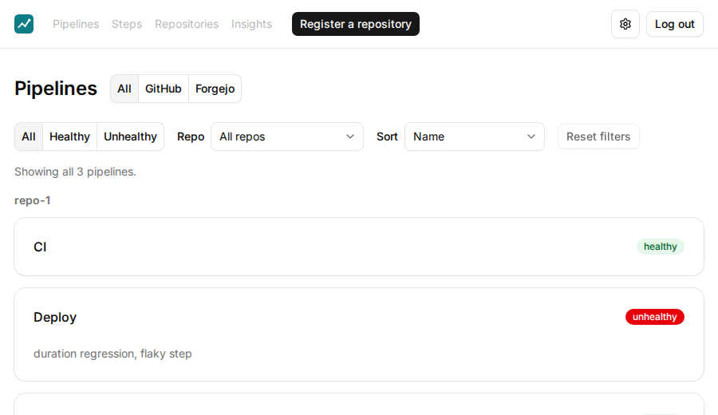
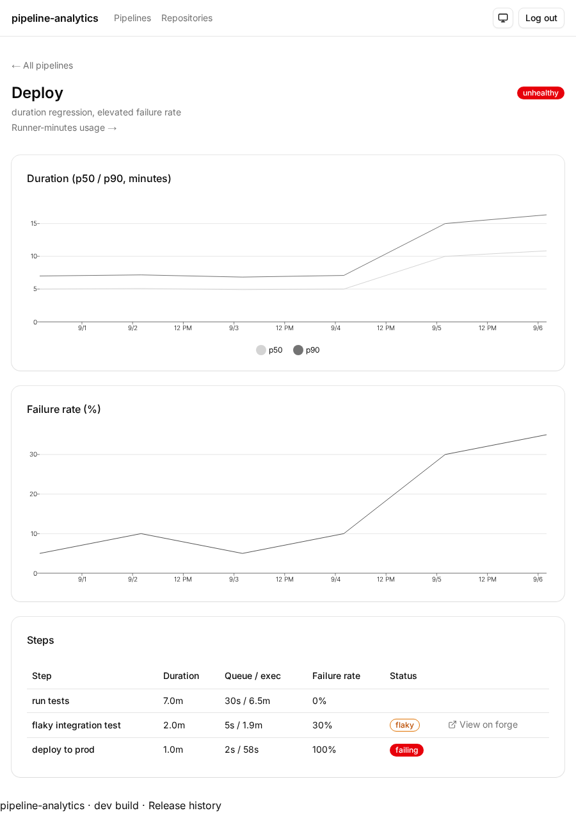
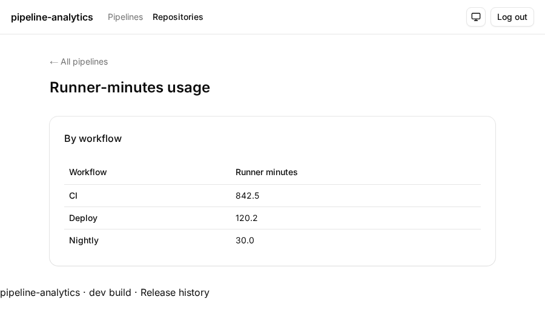
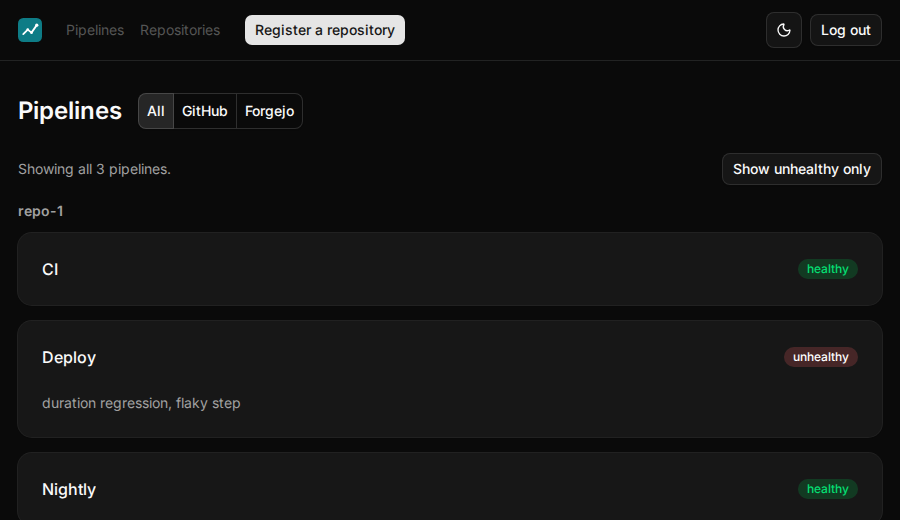
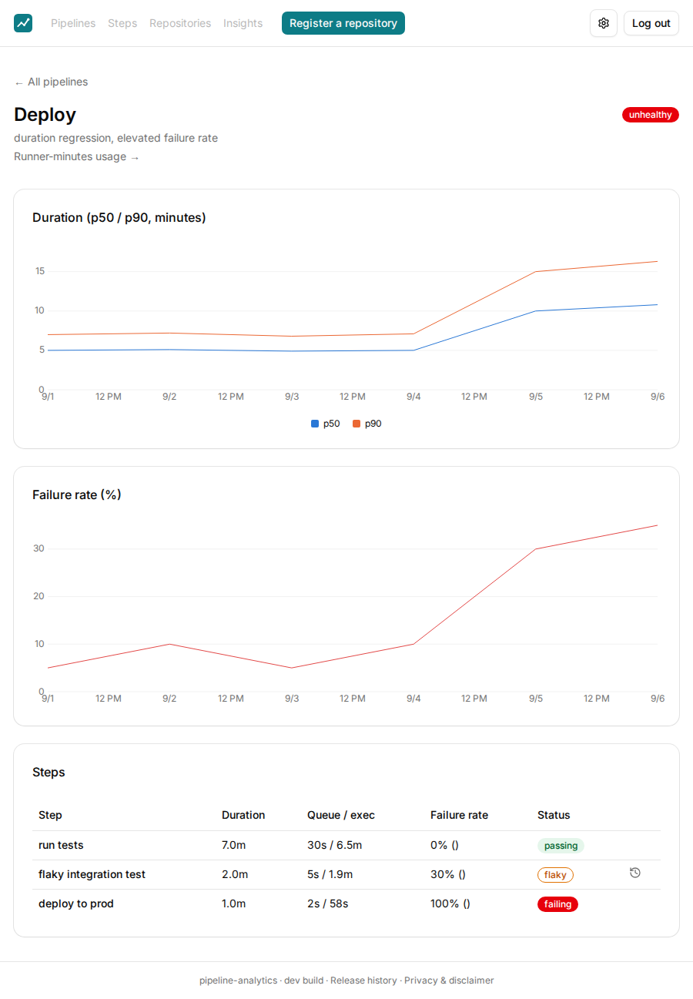

# pipeline-analytics

[](https://github.com/alrayyes/pipeline-analytics/actions/workflows/ci.yml)
[](https://codecov.io/gh/alrayyes/pipeline-analytics)
[](https://github.com/alrayyes/pipeline-analytics/releases)
[](LICENSE)
[](https://pkg.go.dev/github.com/alrayyes/pipeline-analytics)

Self-hosted pipeline analytics for GitHub Actions and Forgejo Actions. Track
a repo and see which pipelines and steps take how long, how often they fail,
which steps are flaky, and a health status for each pipeline — with a deep
link from every finding back to the run on the originating forge.

Built for a solo developer running their own repos, not a team. One binary,
one SQLite file, no external services.



<details>
<summary>More screenshots</summary>









</details>

## Requirements

- A GitHub or Forgejo repository to track, and a repo-scoped personal access
  token for it (Actions-read and webhook-management permissions).
- A public HTTPS URL the server is reachable at, so GitHub/Forgejo can
  deliver webhooks to it.
- To build from source: Go 1.27+, and [bun](https://bun.sh) 1.3.x (not 1.4+
  — see `web/package.json`'s lockfile note) if you're also building the
  frontend.

Login is [WebAuthn](https://webauthn.io/) (passkey) only, no password path.
The dashboard supports exactly one account.

## Installation

**Docker** (recommended):

```sh
docker pull ghcr.io/alrayyes/pipeline-analytics:latest
```

**Prebuilt binary**: download the archive for your platform from the
[latest release](https://github.com/alrayyes/pipeline-analytics/releases/latest)
and extract the `pipeline-analytics` binary onto your `PATH`.

**From source**:

```sh
git clone https://github.com/alrayyes/pipeline-analytics.git
cd pipeline-analytics
(cd web && bun install --frozen-lockfile && bun run build)
go build -o pipeline-analytics ./cmd/pipeline-analytics
```

## Usage

```sh
pipeline-analytics serve \
  --addr :8080 \
  --db pipeline-analytics.db \
  --callback-url https://pipelines.example.com \
  --encryption-key "$(openssl rand -hex 32)"
```

Then open `--callback-url` in a browser to register your passkey (first
run) or log in, and register a repo to track from the dashboard.

The dashboard is installable as its own app — most browsers offer an
installation prompt automatically, or use the browser's menu (Chrome/Edge:
"Install pipeline-analytics…"; Safari: "Add to Dock"). It opens in its own
window with no browser chrome, same as any other installed PWA. This is
a live-data dashboard, not an offline app — installing it doesn't cache
pipeline data for offline use, only the app shell itself.

### Running via Docker

```sh
docker run -d \
  -p 8080:8080 \
  -v pipeline-analytics-data:/data \
  -e PIPELINE_ANALYTICS_DB=/data/pipeline-analytics.db \
  -e PIPELINE_ANALYTICS_CALLBACK_URL=https://pipelines.example.com \
  -e PIPELINE_ANALYTICS_ENCRYPTION_KEY="$(openssl rand -hex 32)" \
  ghcr.io/alrayyes/pipeline-analytics:latest
```

Put a reverse proxy (Caddy, Tailscale Funnel, your VPS's existing one) in
front for TLS — the server itself speaks plain HTTP on `--addr`.

## Configuration

Flags and environment variables (`PIPELINE_ANALYTICS_<FLAG>`, uppercased
with `-` replaced by `_`) are both read, flags winning. There's no config
file — this runs as a long-lived service behind Docker or systemd, not an
interactive CLI a human persists a preference for:

| Flag                   | Environment variable                    | Default                 | Required |
| ---------------------- | --------------------------------------- | ----------------------- | -------- |
| `--addr`               | `PIPELINE_ANALYTICS_ADDR`               | `:8080`                 | no       |
| `--db`                 | `PIPELINE_ANALYTICS_DB`                 | `pipeline-analytics.db` | no       |
| `--callback-url`       | `PIPELINE_ANALYTICS_CALLBACK_URL`       | —                       | **yes**  |
| `--encryption-key`     | `PIPELINE_ANALYTICS_ENCRYPTION_KEY`     | —                       | **yes**  |
| `--reconcile-interval` | `PIPELINE_ANALYTICS_RECONCILE_INTERVAL` | `1h`                    | no       |
| `--log-level`          | `PIPELINE_ANALYTICS_LOG_LEVEL`          | `info`                  | no       |

- `--callback-url` is this server's own public base URL. It's used as the
  WebAuthn relying party origin and the base the forge webhook callback path
  is built from. It has to match what a browser and GitHub/Forgejo actually
  reach the server at.
- `--encryption-key` is a hex-encoded 32-byte (AES-256) key that repo
  access tokens are encrypted under at rest. Generate one with
  `openssl rand -hex 32` and keep it — losing it means every tracked repo's
  token has to be re-entered.
- `--reconcile-interval` bounds how often the server polls each tracked
  repo to backfill history and catch a webhook delivery that was missed.
  Webhooks carry the real-time load; this is the fallback, not the
  primary path.
- `--log-level` is `debug`, `info`, `warn`, or `error`. `debug` adds a line
  for each webhook received/rejected/processed, each reconciliation poll,
  and each repo discovery request — useful when a repo's stuck at
  "degraded" and the reason isn't obvious from the dashboard alone.

## Architecture

See [ARCHITECTURE.md](ARCHITECTURE.md) for how it's put together and the
[decision log](docs/adr/) behind the choices that would cost real rework
to reverse.

## Contributing

See [CONTRIBUTING.md](CONTRIBUTING.md).

## License

[AGPL-3.0](LICENSE)
