# pipeline-analytics

[](https://github.com/alrayyes/pipeline-analytics/actions/workflows/ci.yml)
[](https://codecov.io/gh/alrayyes/pipeline-analytics)
[](https://github.com/alrayyes/pipeline-analytics/releases)
[](LICENSE)
[](https://pkg.go.dev/github.com/alrayyes/pipeline-analytics)

Self-hosted pipeline analytics for GitHub Actions and Forgejo Actions. Track
a repo and see which pipelines and steps take how long, how often they fail,
which steps are flaky, where failures cluster, and a health status for each
pipeline — with a deep
link from every finding back to the run on the originating forge.

Built for a solo developer running their own repos, not a team. One binary,
one SQLite file, no external services.

<!-- screenshots:start -->
<!-- Generated by web/scripts/update-readme-screenshots.ts. Do not edit by hand. -->

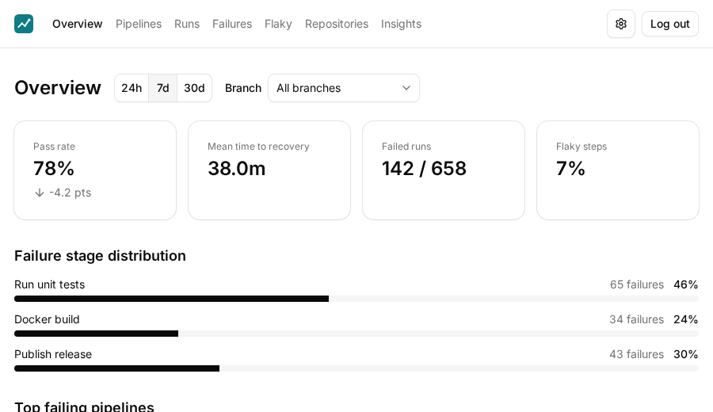

<details>
<summary>More screenshots</summary>

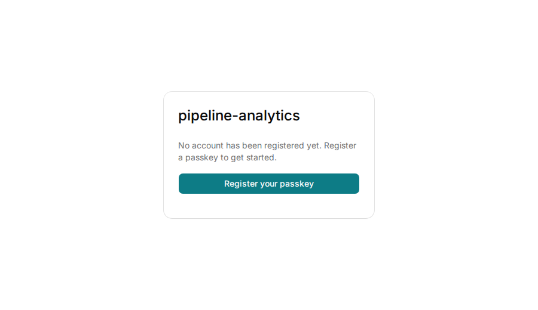

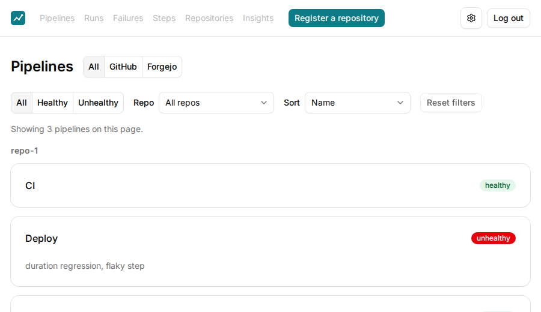


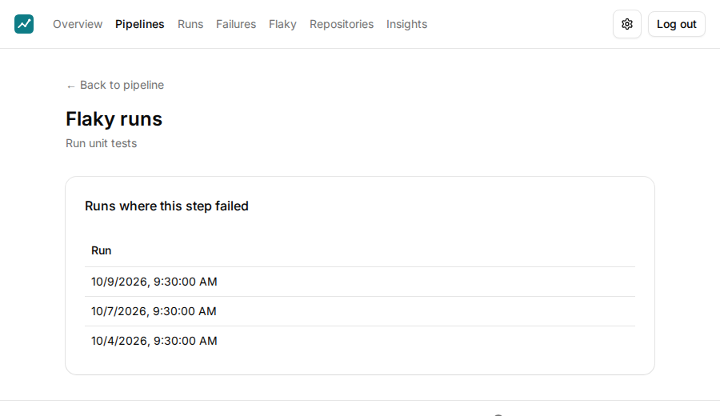

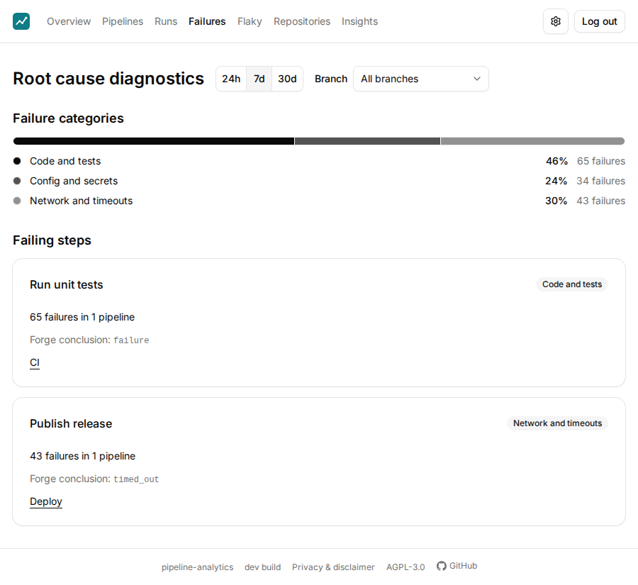

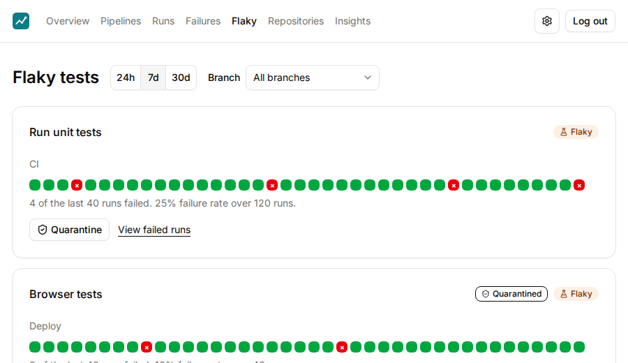

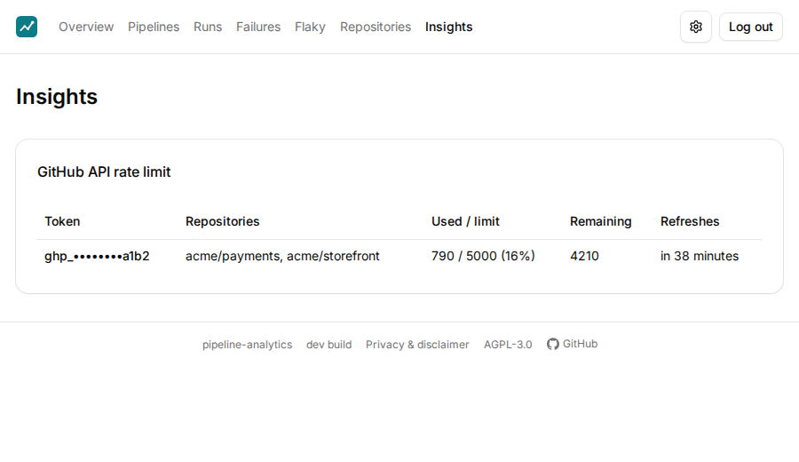

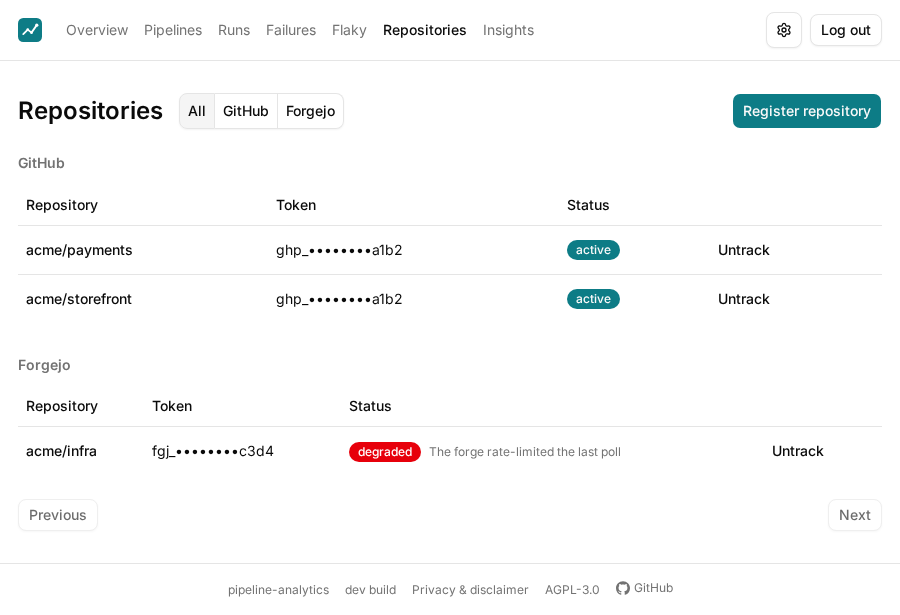

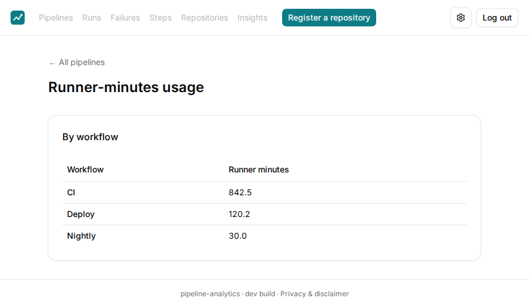

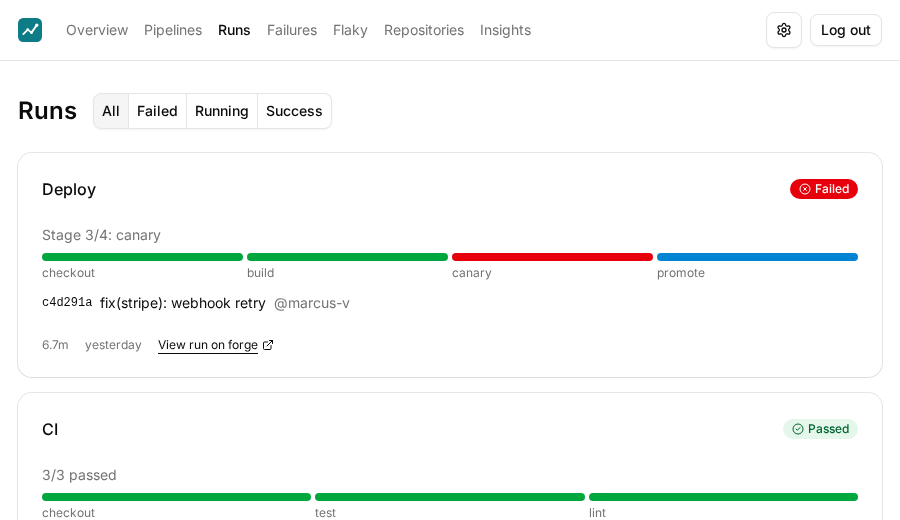

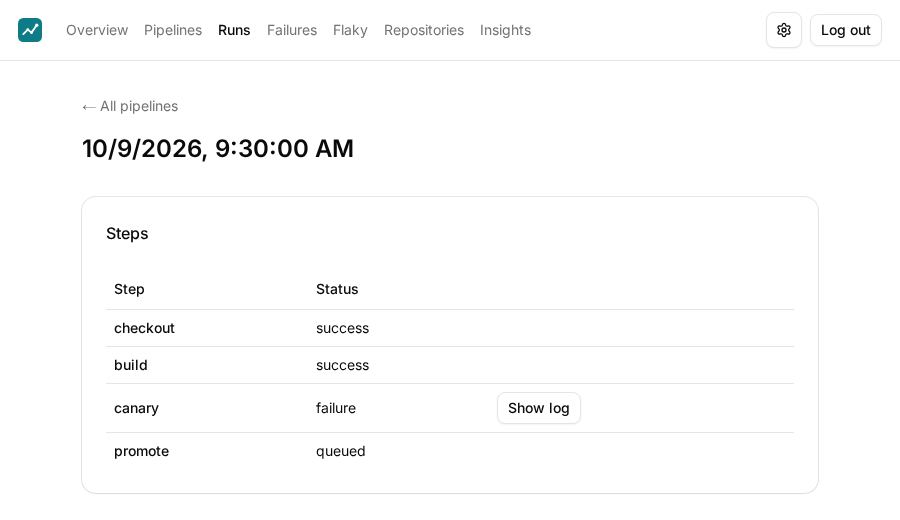

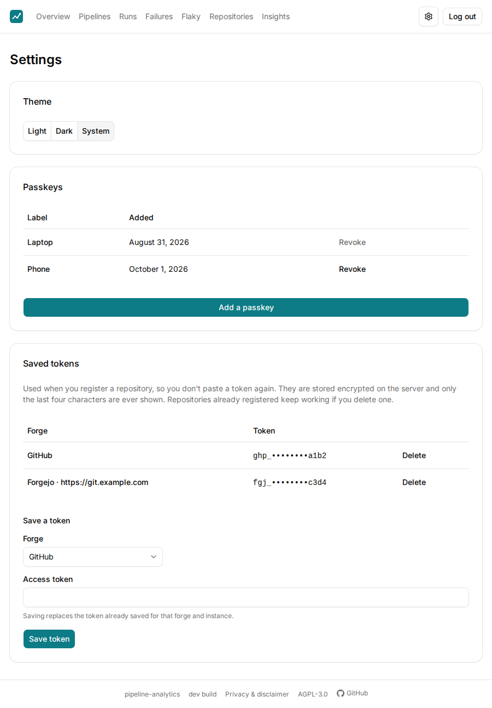

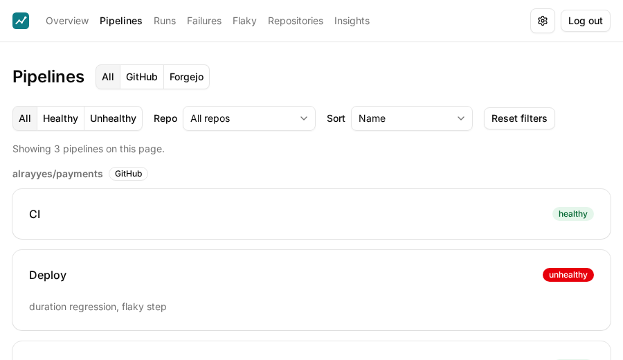

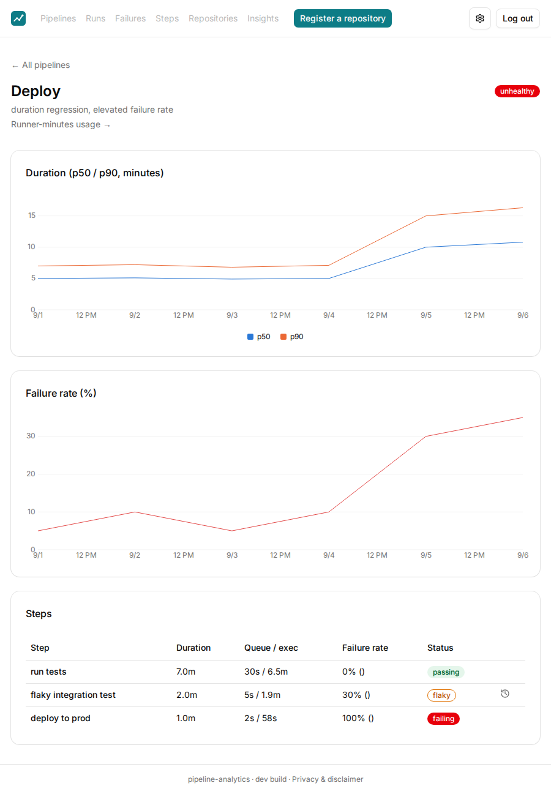

</details>
<!-- screenshots:end -->

The overview, root-cause, flaky and runs views can be scoped to one branch
with the branch selector beside the window; with none chosen they cover every
branch.

A flaky step you already know about can be **quarantined** (a signed-in session
only: `PUT /api/pipelines/{pipelineId}/steps/{step}/quarantine`, `DELETE` to
clear). It stays in the flaky list, labelled, with every figure unchanged, but
it stops making its pipeline unhealthy and stops counting in the flaky-step
ratio. The mark lasts 30 days unless renewed, lives in this server only, and
never touches the forge. API tokens and the MCP tools can read it, not set it.

Open a run and a failed step has a **Show log** button: the last 200 lines of
that step's job log, fetched from the forge when you ask and never stored, with
ANSI colors drawn. A forge with no log API (Forgejo before v16), an expired
log or a token that can't read it says so and still links to the job on the
forge.

A concluded GitHub run has a **Re-run** button on the Runs view. It asks GitHub
to re-run the failed jobs (every job if the run passed) and needs a saved token
with Actions write permission. A queued or running GitHub run has a **Cancel
run** button instead, which asks you to confirm first. Forgejo runs get
neither.

## Requirements

- A GitHub or Forgejo repository to track, and a repo-scoped personal access
  token for it. Reading Actions and managing webhooks are enough to track a
  repository; re-running or cancelling runs from the dashboard also needs
  Actions write permission, and a token without it is refused with a message
  that points you at Settings. Instead of typing it for each repo, save one
  per forge (and Forgejo instance) under Settings → Saved tokens, or with
  `PUT /api/forge-tokens` from a logged-in session: registering or
  discovering with no token then uses the saved one. It's stored encrypted
  and never returned, only its last four characters.
- A public HTTPS URL the server is reachable at, so GitHub/Forgejo can
  deliver webhooks to it.
- To build from source: Go 1.27+, and [bun](https://bun.sh) 1.3.x (not 1.4+
  — see `web/package.json`'s lockfile note) if you're also building the
  frontend.

Login is [WebAuthn](https://webauthn.io/) (passkey) only, no password path.
The dashboard supports exactly one account.

## Installation

**Docker** (recommended):

```sh
docker pull ghcr.io/alrayyes/pipeline-analytics:latest
```

**Prebuilt binary**: download the archive for your platform from the
[latest release](https://github.com/alrayyes/pipeline-analytics/releases/latest)
and extract the `pipeline-analytics` binary onto your `PATH`.

**From source**:

```sh
git clone https://github.com/alrayyes/pipeline-analytics.git
cd pipeline-analytics
(cd web && bun install --frozen-lockfile && bun run build)
go build -o pipeline-analytics ./cmd/pipeline-analytics
```

## Usage

```sh
pipeline-analytics serve \
  --addr :8080 \
  --db pipeline-analytics.db \
  --callback-url https://pipelines.example.com \
  --encryption-key "$(openssl rand -hex 32)"
```

Then open `--callback-url` in a browser to register your passkey (first
run) or log in, and register a repo to track from the dashboard.

The dashboard is installable as its own app — most browsers offer an
installation prompt automatically, or use the browser's menu (Chrome/Edge:
"Install pipeline-analytics…"; Safari: "Add to Dock"). It opens in its own
window with no browser chrome, same as any other installed PWA. This is
a live-data dashboard, not an offline app — installing it doesn't cache
pipeline data for offline use, only the app shell itself.

### Running via Docker

```sh
docker run -d \
  -p 8080:8080 \
  -v pipeline-analytics-data:/data \
  -e PIPELINE_ANALYTICS_DB=/data/pipeline-analytics.db \
  -e PIPELINE_ANALYTICS_CALLBACK_URL=https://pipelines.example.com \
  -e PIPELINE_ANALYTICS_ENCRYPTION_KEY="$(openssl rand -hex 32)" \
  --cap-drop=ALL \
  --security-opt=no-new-privileges \
  --read-only \
  --memory=256m \
  ghcr.io/alrayyes/pipeline-analytics:latest
```

Everything the server writes goes to `/data` (the SQLite file and its
WAL), so `--read-only` on the rest of the container is safe.
The image creates `/data` owned by the container's non-root user (user ID 10001), so
a fresh named volume works as written. A bind mount (`-v ./data:/data`) keeps
the host directory's owner, so it has to be writable by user ID 10001, for
example `chown 10001:10001 ./data`; the server says so at startup if it isn't. Adjust
`--memory` to what your host can spare — 256m is comfortable headroom
for a single Go binary and SQLite, not a measured minimum.

The image reports its own health: `docker ps` shows `healthy` once
`/readyz` answers 200, meaning the server is up _and_ its database
answers, and `unhealthy` after three failed checks 30 seconds apart. A
database that's unreachable (a locked or unreadable file, a full disk)
makes `/readyz` return 503 while `/healthz`, which only confirms the
process is up, stays 200. An orchestrator can then tell a process worth
restarting from an instance that can't serve right now. Both are public
and unauthenticated.

Put a reverse proxy (Caddy, Tailscale Funnel, your VPS's existing one) in
front for TLS — the server itself speaks plain HTTP on `--addr`.

The server sends the dashboard's hashed files with a one-year `immutable`
cache lifetime and everything else with `no-cache` and a content hash, so a
repeat visit checks the page is current and re-downloads nothing else. The build writes
Brotli and gzip copies of its text files, and the server picks one by
`Accept-Encoding`, so the dashboard needs no compression at the proxy. API
responses are not compressed by the server; turn that on at the proxy if you
want it.

The server doesn't rate-limit itself; that's the proxy's job. The routes
reachable without a session are the login ceremony (`/api/auth/`), the forge
webhook receivers (`/webhooks/`) and the health, readiness and version
endpoints. Limit those at the proxy. The server still caps request bodies and
verifies the signature on each webhook before doing any work. Passkey login can't be
brute-forced the way a password can, which is why this is left to the proxy
and not built into a single-user tool.

## Configuration

Flags and environment variables (`PIPELINE_ANALYTICS_<FLAG>`, uppercased
with `-` replaced by `_`) are both read, flags winning. There's no config
file — this runs as a long-lived service behind Docker or systemd, not an
interactive CLI a human persists a preference for:

| Flag                   | Environment variable                    | Default                 | Required |
| ---------------------- | --------------------------------------- | ----------------------- | -------- |
| `--addr`               | `PIPELINE_ANALYTICS_ADDR`               | `:8080`                 | no       |
| `--db`                 | `PIPELINE_ANALYTICS_DB`                 | `pipeline-analytics.db` | no       |
| `--callback-url`       | `PIPELINE_ANALYTICS_CALLBACK_URL`       | —                       | **yes**  |
| `--encryption-key`     | `PIPELINE_ANALYTICS_ENCRYPTION_KEY`     | —                       | **yes**  |
| `--reconcile-interval` | `PIPELINE_ANALYTICS_RECONCILE_INTERVAL` | `1h`                    | no       |
| `--drain-period`       | `PIPELINE_ANALYTICS_DRAIN_PERIOD`       | `4s`                    | no       |
| `--shutdown-timeout`   | `PIPELINE_ANALYTICS_SHUTDOWN_TIMEOUT`   | `5s`                    | no       |
| `--log-level`          | `PIPELINE_ANALYTICS_LOG_LEVEL`          | `info`                  | no       |

- `--callback-url` is this server's own public base URL. It's used as the
  WebAuthn relying party origin and the base the forge webhook callback path
  is built from. It has to match what a browser and GitHub/Forgejo actually
  reach the server at.
- `--encryption-key` is a hex-encoded 32-byte (AES-256) key that repo
  access tokens, and saved forge tokens, are encrypted under at rest. Generate one with
  `openssl rand -hex 32` and keep it — losing it means every tracked repo's
  token has to be re-entered.
- `--reconcile-interval` bounds how often the server polls each tracked
  repo to backfill history and catch a webhook delivery that was missed.
  Webhooks carry the real-time load; this is the fallback, not the
  primary path.
- `--drain-period` and `--shutdown-timeout` shape a shutdown. On SIGTERM the
  server flips `/readyz` to 503 and keeps serving for the drain period, so a
  router polling it takes the instance out of rotation, then closes and gives
  in-flight requests the shutdown timeout to finish. Together they stay under
  the ten seconds Docker waits before it kills the container; raise them
  together with `docker stop --time` if you change either.
- `--log-level` is `debug`, `info`, `warn`, or `error`. `debug` adds a line
  for each webhook received/rejected/processed, each reconciliation poll,
  and each repo discovery request — useful when a repo's stuck at
  "degraded" and the reason isn't obvious from the dashboard alone.

## API

Docs generated from [`openapi/openapi.yaml`](openapi/openapi.yaml), browsable
at <https://alrayyes.github.io/pipeline-analytics/docs/api/>.

## MCP

`POST /api/mcp` serves an [MCP](https://modelcontextprotocol.io) server over
the Streamable HTTP transport, exposing the same pipeline health, trend,
flaky-step, usage, run and failure-insight data the dashboard and REST API do,
as eleven read-only tools. Every read endpoint that serves pipeline data has a
tool; a test fails when one doesn't, unless it's listed with a reason. It
needs the same bearer API token as the REST API — issue one with a
logged-in session, either from Settings → API tokens (pick 30 days, 90 days
or 1 year; the token is shown once) or with `curl -X POST https://<your-server>/api/auth/tokens
--cookie "session=<your-session-cookie>"`. A token lasts 90 days unless you
ask for another lifetime with `-d '{"ttlSeconds": 2592000}'` (30 days here);
the longest is 365 days, and the response's `expiresAt` says when it ends.

Point an MCP-capable client at `https://<your-server>/api/mcp` with that
token as a bearer `Authorization` header. For example, with `mcp-remote`
in a client's MCP config:

```json
{
  "mcpServers": {
    "pipeline-analytics": {
      "command": "npx",
      "args": [
        "mcp-remote",
        "https://<your-server>/api/mcp",
        "--header",
        "Authorization: Bearer <your-token>"
      ]
    }
  }
}
```

## Architecture

See [ARCHITECTURE.md](ARCHITECTURE.md) for how it's put together and the
[decision log](docs/adr/) behind the choices that would cost real rework
to reverse.

## Reports

Every push to `main` that passes CI publishes its reports next to the API
docs, so you can check the project's health without opening a pipeline run:

- [Test results](https://apis.ryankes.eu/pipeline-analytics/reports/tests/):
  JUnit XML for the Go, frontend and end-to-end suites.
- [Coverage](https://apis.ryankes.eu/pipeline-analytics/reports/coverage/):
  Cobertura XML, with the Go HTML view and the native Go and lcov files beside it.
- [Lighthouse](https://apis.ryankes.eu/pipeline-analytics/reports/lighthouse/):
  the audit of the login page and the signed-in pages.

## Contributing

See [CONTRIBUTING.md](CONTRIBUTING.md).

## License

[AGPL-3.0](LICENSE)
